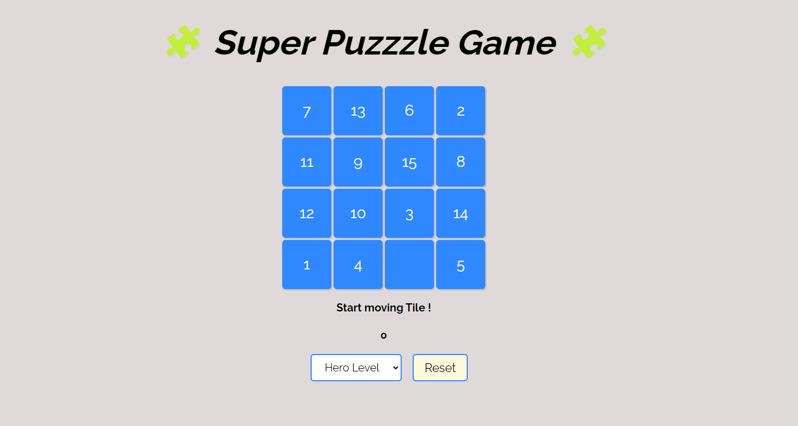

# Pure javascript Puzzle Game 🧩

[A Puzzle game with power of pure JavaScript](https://puzzzle-purejs.vercel.app/) and with the power of mathematics. The game is composed of a grid of tiles that have different colors and shapes. The pattern shown at the top of the screen has to be matched by swapping and arranging the tiles in a way. The game has different levels of difficulty and complexity, and the player's logic, memory, and spatial skills are challenged by it.

A feature of my game is that unresolvable situations are checked for, which are situations where the puzzle cannot be completed by the player no matter how they swap the tiles. A mathematical algorithm was used by me to detect these situations and generate a new puzzle for the player. This way, a fair and solvable puzzle is always ensured for the player by the game➕.

### Tools and Techniques used

- [Javascript Patterns](https://patterns.dev) With power of pure js language and with help of some proper design patterns like Observer, Singleton.

- [Vitest](https://vitest.dev) To ensure that the game works properly in all situation by writing unit tests🧪(98% of code coverage).

### Next Features

- Add some cool animations 🛣️.

- Add timer to add challenge in solving the puzzle🪨.

### Contributions

I appreciate your interest in the project! If you have any feedback, suggestions, or resources related to the game, please feel free to share.

Thank you!
